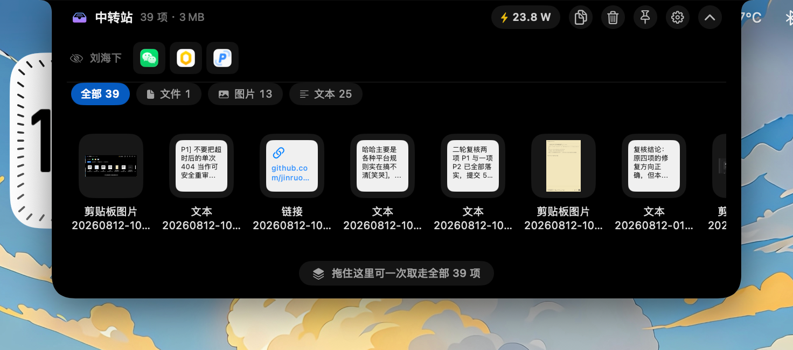

# NotchIsland · 刘海岛

**[中文](README.md)**

Turn your MacBook notch into a multifunctional island: **file staging**, **recover hidden menu bar icons**, and **real-time power monitoring**.

[](https://github.com/2922178532/NotchIsland/releases/latest)
[](https://github.com/2922178532/NotchIsland/actions/workflows/ci.yml)

-black)

[](LICENSE)

**[Download latest release →](https://github.com/2922178532/NotchIsland/releases/latest)**

<div align="center">
  
</div>

## Highlights

- Drop files into the notch to stage them, switch to any app, and drag them out—no desktop clutter or window juggling
- Copied files, images, text, and links can be collected automatically as a draggable clipboard history
- Recover menu bar icons hidden by the notch; click once to open their original menus
- Hover over the notch to see system power draw, with a full power dashboard built in
- Runs fully offline—no network requests, telemetry, or update checks
- Zero third-party dependencies, pure Swift, ~6 MB universal binary

## Quick start

1. Download the `.dmg` from [Releases](https://github.com/2922178532/NotchIsland/releases/latest)
2. Open it and drag **NotchIsland** (刘海岛) into your Applications folder
3. If macOS blocks the app on first launch, **right-click the app in Finder → Open**

After installation, a menu bar tray icon appears. Move your mouse to the notch to expand the panel. File staging and hotkeys work out of the box with **no permissions required**; grant Accessibility when prompted if you want the menu bar icon recovery feature.

Prebuilt binaries are **universal** (Apple Silicon + Intel) and run natively on both. Note that the author only has Apple Silicon hardware—the Intel slice is cross-compiled but never verified on a real machine, so please file an issue if something breaks. Macs without a physical notch (or external displays) are supported too; the app simulates a menu-bar-height island at the top center of the screen.

<details>
<summary><b>Build from source</b></summary>

Requires macOS 14+ and Swift 5.9 or newer (Xcode or Command Line Tools—full Xcode is not required).

```bash
git clone https://github.com/2922178532/NotchIsland.git
cd NotchIsland
./build.sh                 # Output: dist/刘海岛.app
open dist/刘海岛.app
```

Use `./build.sh debug` for a debug build. By default only the host architecture is compiled; set an environment variable to produce a universal binary (arm64 + x86_64, roughly double the build time):

```bash
NOTCHISLAND_UNIVERSAL=1 ./build.sh
```

To sign with your own developer certificate:

```bash
NOTCHISLAND_SIGN_IDENTITY="Developer ID Application: Your Name (TEAMID)" ./build.sh
```

Run the unit tests (notch geometry, pasteboard parsing, shelf storage, powermetrics output parsing):

```bash
swift test
```

</details>

<details>
<summary><b>Permissions</b></summary>

| Permission | Required? | Purpose |
| --- | --- | --- |
| Accessibility | Required for menu bar icon recovery | Enumerate status bar items and simulate clicks |
| Screen Recording | Optional | Capture real icons for Control Center modules (Display, Sound, etc.); without it, they show as the Control Center app icon—functionality is unaffected |
| Notifications | Optional | Abnormal power draw alerts |
| Administrator password | Optional, once | Create a sudo rule limited to `powermetrics` when enabling power "Precise Mode" |

If Gatekeeper is strict, you can manually remove the quarantine attribute:

```bash
xattr -dr com.apple.quarantine "/Applications/刘海岛.app"
```

> With ad-hoc signing, **each rebuild is treated as a new app** by the system. You may need to remove the old entry under System Settings → Privacy & Security → Accessibility and re-authorize. Signing with a fixed certificate avoids this.

</details>

## Usage

| Action | Effect |
| --- | --- |
| Move mouse to notch | Island scales up slightly, then expands into the full panel after a short delay |
| Drag files near the notch | Island expands and highlights immediately; release to store |
| Drag out from a card | Copy that item to the target app |
| Drag the bottom handle | Take all items in the current list at once |
| Double-click a card | Open with the default app |
| Right-click a card | Open / Copy to clipboard / Reveal in Finder / Show original location / Remove |
| `⌃⌥Space` | Show / hide NotchIsland |
| `⌃⌥C` | Save clipboard contents to NotchIsland |

Besides files, images dragged from the browser, selected text, and web links are stored as appropriate file types. Drag-out always uses **copy** semantics—the target app gets a copy; items remain in NotchIsland.

<details>
<summary><b>More UI details</b></summary>

The top-right of the panel shows, in order: power badge, copy all, clear, pin, settings, and collapse. Click the **pin** to keep the panel expanded when the mouse leaves.

When NotchIsland holds more than one content type, **category filters** appear above the panel (All / Files / Images / Text). The "take all" handle at the bottom follows the current filter.

Hotkeys are registered via Carbon and do not require Accessibility. If a shortcut is taken by another app, the menu item is marked "shortcut in use". To change shortcuts, edit the two `Shortcut` definitions at the end of `Sources/NotchIsland/Core/HotKeyManager.swift`.

</details>

## Clipboard

Besides drag-and-drop, NotchIsland can take over your clipboard.

**Manual save**: Press `⌃⌥C` to save current clipboard contents—files, screenshots, selected text, and links are all supported.

**Auto-collect** (off by default): Enable "Auto-collect clipboard contents" in the menu and every copy is saved automatically—a draggable clipboard history. Text renders as sticky-note cards; links show their domain so you can tell at a glance.

Auto-collect avoids clutter by: skipping content marked private by password managers, excluding NotchIsland's own staging directory to prevent loops, deduplicating consecutive copies of the same content, and capping at 10 files per collect. Clipboard changes are tracked even while the toggle is off, so turning it on won't flood you with old copies.

You can also copy everything to the clipboard from the top-right button, or copy a single card via right-click.

<details>
<summary><b>Menu bar settings</b></summary>

Click the tray icon (or the gear on the island) to open settings:

- **Auto cleanup**: Keep forever / 1 / 3 / 7 / 30 days (default 7). Checked at launch and hourly thereafter.
- **Hover expand delay**: Instant / 0.1 / 0.25 / 0.5 / 1 s (default 0.25 s).
- **Idle appearance**: What the island looks like when the mouse is away—"Collapsed (native notch)" or "Hovering (always-on power draw)", default collapsed. Hovering keeps the island slightly enlarged with live power draw always visible, at the cost of a permanently larger notch area.
- **Auto-collect clipboard contents**: Off by default. See [Data & privacy](#data--privacy) below.
- **Drop sound**: Nine system sounds (including off); default "Tink"; selecting one plays a preview.
- **Show icons hidden by the notch**: Master toggle for menu bar icon recovery (on by default).
- **Restore "Don't show again" icons**: Clear your right-click exclusion list.
- **Hide in fullscreen apps**: Collapse the island when an app goes fullscreen (on by default). Hotkey or menu invocation temporarily overrides this. Automatically disabled if the menu bar is set to auto-hide.
- **Hide idle indicator bar**: Hides only the gradient bar in collapsed state for a native notch look; hover, drag, and hotkey behavior unchanged.
- **Launch at login**: Requires the app to be in Applications.
- **Move to Applications folder**: One-click copy and restart; this option hides itself when done.

</details>

<details>
<summary><b>Menu bar icons hidden by the notch</b></summary>

The "Under notch" row in the expanded panel lists all status bar icons swallowed by the notch (including Control Center modules):

- **Left-click**: Same as clicking the original menu bar icon—the island collapses to free the top edge, and the icon's menu opens in place without moving your mouse.
- **Right-click**: Action menu (Open menu / Activate app / Quit app / Don't show this icon). "Quit" is especially useful for background apps whose icons you can't see.
- **Live status**: Status text starting with numbers (e.g. power meter "12.3 W") appears next to the icon; hover for other info.

Notes:

- When third-party apps are hidden, the system zeroes their icon window position, so the row shows the app icon rather than the exact menu bar glyph—clicks still work.
- Per-app right-click menus cannot be forwarded: hidden icons have no valid screen position, and the accessibility layer only exposes a press action.
- Scanning runs concurrently in the background (250 ms timeout per process); dozens of apps typically finish in ~1 s, with "Scanning menu bar…" shown meanwhile.

</details>

<details>
<summary><b>Power monitoring</b></summary>

Power features are integrated from MIT-licensed [JuiceFlow](https://github.com/imadhy/juice-flow) ([Chinese fork](https://github.com/2922178532/JuiceFlow-Chinese)), with self-update and a standalone menu bar entry removed.

- **Hover notch**: Shows current system power (SMC `PSTR` / `PPBR` sensors, no permission needed) and staged file count along the bottom edge.
- **Dashboard**: Open via the power badge—battery ring, remaining runtime estimate, energy impact ranking, 24 h history, today's top consumers.
- **Precise mode**: Enable Apple `powermetrics` in the dashboard (real watts, GPU, system processes). First enable asks for admin password once to create a **powermetrics-only** sudo rule; remove it anytime in settings.
- **Alerts**: Notifications when an app draws abnormally on battery; sensitivity in "Power monitoring settings…".
- Battery reads every 3 s (IOKit, minimal overhead); process sampling drops to every 30 s when the dashboard is closed.

</details>

## Data & privacy

NotchIsland **runs fully offline**—no network requests, telemetry, or update checks. All data stays on your machine:

```
~/Library/Application Support/NotchIsland/
├── index.json          # Metadata for staged items
└── Items/<UUID>/<original filename>

~/Library/Application Support/JuiceFlow/
└── history.sqlite      # Power history
```

Dropped files are **copied** here, so moving or deleting originals does not affect NotchIsland copies. Staged content uses disk space and is auto-cleaned after 7 days by default. Use "Open staging folder" in the menu to inspect.

With [auto-collect clipboard](#clipboard) enabled, copied content is written to the same directory. The app honors macOS `ConcealedType` / `TransientType` to skip password-manager content, but **sensitive text not correctly marked by the source app may still be stored in plain text**—if you often copy passwords, keys, or tokens, keep this toggle off (default).

## Known limitations

- Prebuilt binaries are universal, but the Intel slice is only cross-compiled—never verified on real hardware.
- Ad-hoc signing triggers Gatekeeper prompts and requires re-granting Accessibility after each rebuild.
- No auto-update—download new releases manually.
- Preview quality. Pure-logic code (geometry, pasteboard parsing, shelf storage, powermetrics parsing) is covered by unit tests; UI and system integration are still verified by hand. [Issues](https://github.com/2922178532/NotchIsland/issues) welcome.

<details>
<summary><b>Troubleshooting</b></summary>

Check whether notch geometry is detected correctly:

```bash
"/Applications/刘海岛.app/Contents/MacOS/NotchIsland" --diagnose
```

Prints screen size, safe areas, and computed island attachment rect for each display.

To preview the expanded UI without moving the mouse, or verify hotkey registration:

```bash
NOTCHISLAND_AUTOEXPAND=1 NOTCHISLAND_DEBUG=1 "/Applications/刘海岛.app/Contents/MacOS/NotchIsland"
```

If status bar icon detection looks wrong, run these diagnostics in a terminal with Accessibility (requires Accessibility permission):

```bash
swift scripts/menubar-diagnose.swift   # Window level: status bar windows off-screen
swift scripts/ax-diagnose.swift        # Accessibility level: status item positions per app
```

After editing `scripts/make-icon.swift`, regenerate the app icon:

```bash
swift scripts/make-icon.swift
```

</details>

<details>
<summary><b>Code structure</b></summary>

Pure Swift, zero third-party dependencies, built with Swift Package Manager.

```
Sources/NotchIsland/
├── App/            Entry point, menu bar, global hotkeys, scheduled cleanup
├── Core/
│   ├── ScreenGeometry.swift    Notch position and size detection
│   ├── NotchModel.swift        Island state, sizing, window geometry
│   ├── Preferences.swift       User preferences
│   └── HotKeyManager.swift     Global shortcuts
├── Window/
│   ├── NotchPanel.swift            Borderless floating panel
│   ├── NotchWindowController.swift Mouse tracking, state transitions, fullscreen yield
│   └── DropContainerView.swift     Drop target
├── Shelf/
│   ├── ShelfStore.swift         Staged file storage, metadata, expiry cleanup
│   ├── PasteboardImporter.swift Pasteboard parsing (drag + hotkey)
│   └── ClipboardWatcher.swift   Clipboard auto-collect
├── MenuBar/
│   ├── MenuBarItemMonitor.swift    Scan icons hidden by the notch
│   └── MenuBarPermissions.swift    Accessibility / Screen Recording
├── Power/
│   └── PowerCenter.swift   Power service container and dashboard window
├── JuiceFlow/      Power monitoring from JuiceFlow (SMC, process sampling, history, alerts, UI)
└── UI/             SwiftUI views

Tests/NotchIslandTests/  Unit tests: geometry, pasteboard parsing, shelf storage, powermetrics parsing
```

Two key design choices:

1. **Window size follows state.** Collapsed, the window covers only the physical notch—an area you can't click anyway—so it doesn't interfere. It grows only when expanded. During transitions, the window expands to the union of before/after sizes so animations aren't clipped.
2. **When the island is larger than the notch, mouse leave enables click-through** so the expanded panel doesn't block menu bar clicks. Collapsed state always receives events so drops are detected.

</details>

## Roadmap

- Customizable hotkey combinations in the UI
- Clipboard history
- Manual sort and grouping for staged items

## Contributing

Issues and pull requests are welcome. See [CONTRIBUTING.md](CONTRIBUTING.md) for the dev setup, code style, and submission checklist.

For usage questions, "is this a bug?" uncertainty, or half-formed ideas, use [Discussions](https://github.com/2922178532/NotchIsland/discussions) instead.

## Acknowledgments

Power monitoring is ported from [Imad El Hitti](https://github.com/imadhy)'s [JuiceFlow](https://github.com/imadhy/juice-flow),
released under MIT; original copyright remains with the author. Code under `Sources/NotchIsland/JuiceFlow/` comes from that project.

## License

NotchIsland is released under [MIT](LICENSE). Third-party code and licenses are listed in
[THIRD-PARTY-LICENSES.md](THIRD-PARTY-LICENSES.md).
